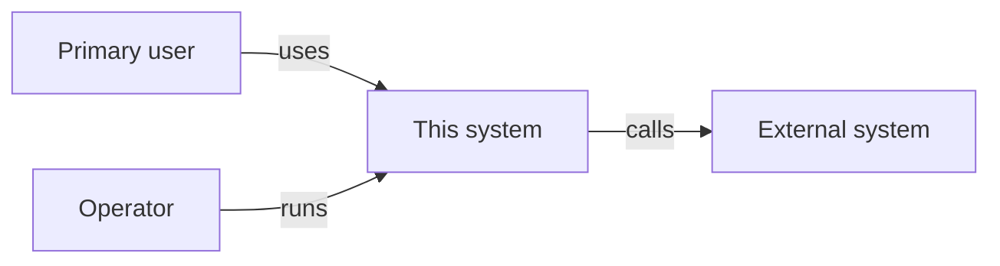
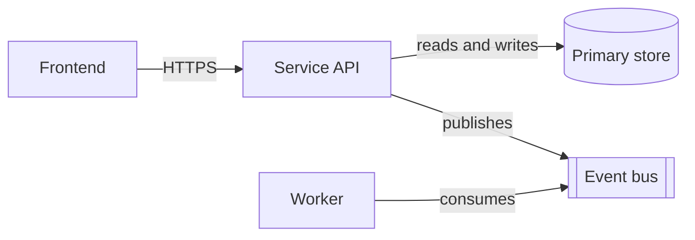
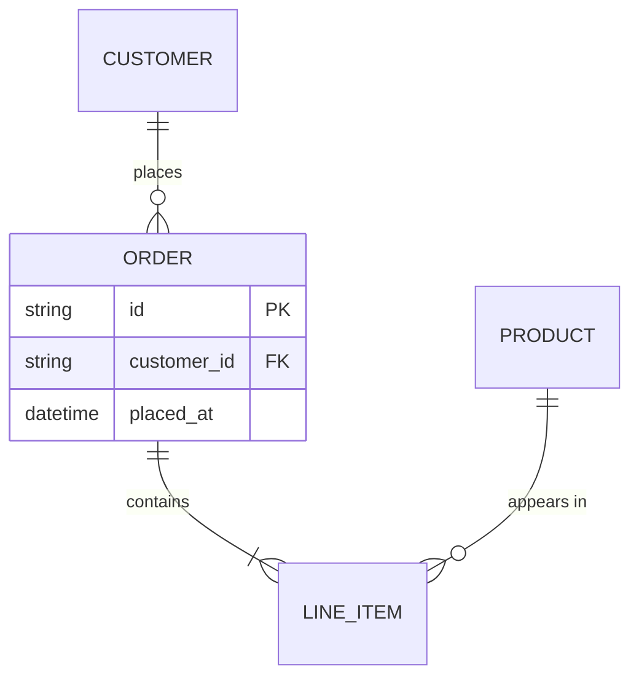
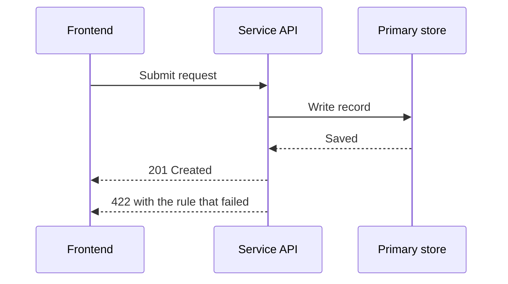
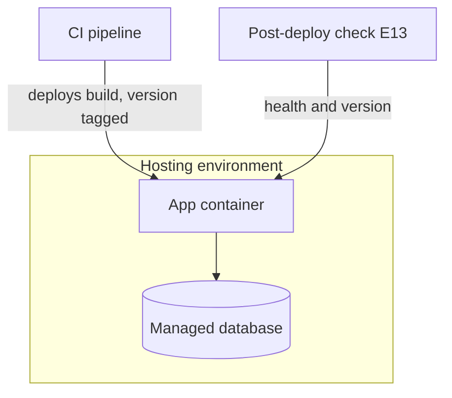

# {{Title}}

Floor rows D2, D6, D7, D8, D13. Each layer has its own author and challenger in front matter
`layers`, and both must be qualified for that layer in `docs/roles.yml`. Check D6 refuses
a layer no qualified seat covers. That refusal opens a crew review.

Diagrams are Mermaid code, tagged on the line above the fence. Replace each sample with
the real thing. Where a diagram and the text disagree, the diagram governs structure.
Check E16 refuses a missing, wrong-form or empty diagram once this file is in review.

## Context

<!-- diagram: context -->

## Components

<!-- diagram: components -->

## Data
Standards: `docs/standards/data/` (STD-001 to STD-005). Floor rows D11, D12, I8.

- **Stores:** {{each persistent store, what it holds, and its system-of-record role}}
- **Schema owner:** {{seat}}. Schema as code at {{path}}; migrations in the folder set in `appliance.yml`.
- **Classification:** {{each dataset's class from the risk assessment, and its retention period}}
- **External datasets:** {{source, quality profile, provenance fields}}
- **Reference and seed data:** {{each dataset, its owner seat, its seed script}}
- **Data Architect seat:** {{not needed, because ...}} or {{adopted, see RP-NNN}}.
  Triggers: `docs/standards/data/README.md`.

Data model: every entity, its key attributes, and each relationship with cardinality.

<!-- diagram: data-model -->

## Domain or computation core
{{The domain logic or computation the product depends on.}}

## Services and APIs
{{}}

## Frontend and presentation
{{}}

## Integration
{{Every exchange between components. Each one has a contract file in the contracts folder
(D12, check E14) and a contract test on both sides (D9).}}

| Exchange | Kind | Producer | Consumers | Contract file |
| --- | --- | --- | --- | --- |

One sequence diagram per critical exchange, failure response included.

<!-- diagram: key-interactions -->

## Deployment and runtime
{{}}

<!-- diagram: deployment -->

## Operations
{{}}

## Failure modes (D7)
For each layer: missing, late, duplicate or malformed input, dependency down, partial
success. Each mode needs a handling rule and a signal that makes the failure loud.

| Layer | Mode | Handling rule | Loud signal |
| --- | --- | --- | --- |

## Decision tables (D8)
Logic with more than three interacting conditions goes here as a table with no empty cells.
