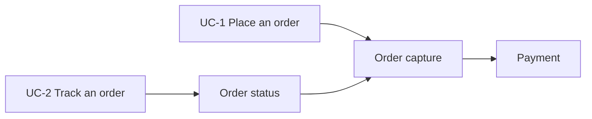

# {{Title}}

Floor rows D1, D13. The challenger reviews cold, in a fresh session.

## Capabilities
| Use case | System capability |
| --- | --- |
| {{UC}} | {{capability}} |

<!-- diagram: capability-map -->

