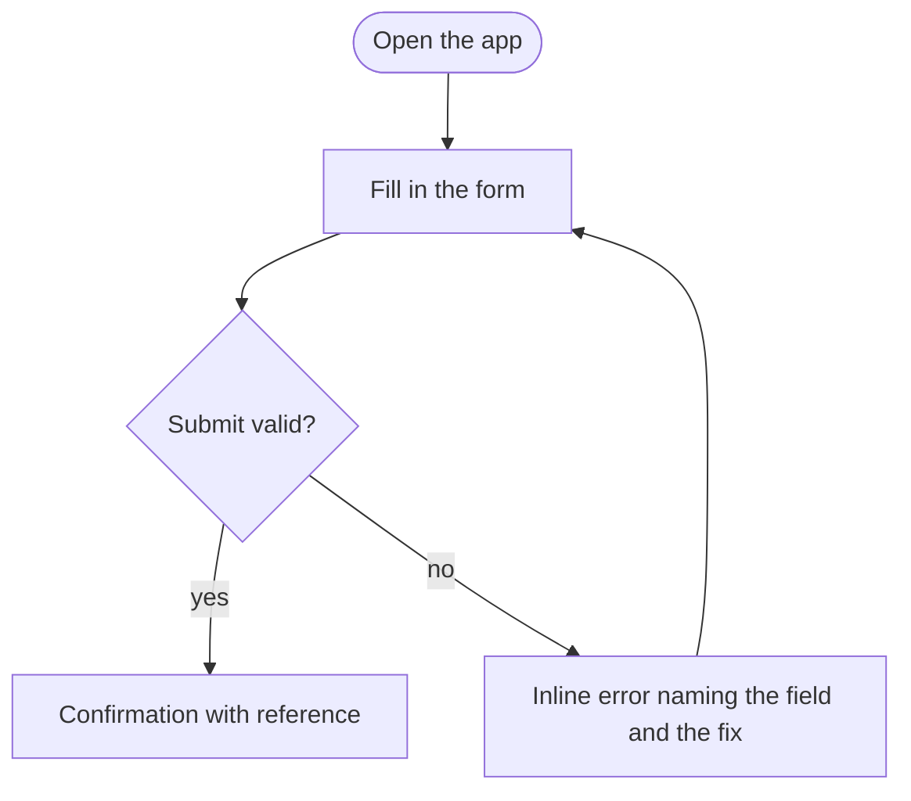
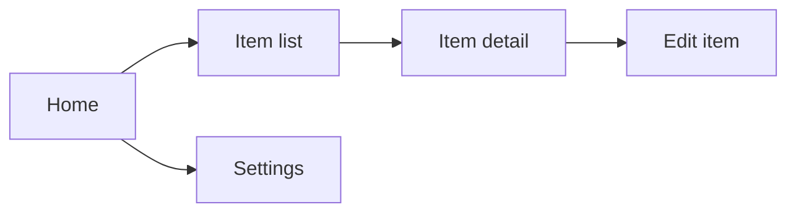

# {{Title}}

Floor rows D4, D13. If the product has no user interface, sign not-applicable in the checklist.
Diagrams are Mermaid code, tagged on the line above the fence. Replace each sample.

## Experience intent
{{What the user should feel and be able to do, in one paragraph. This is the north star
the design system serves.}}

## User flows
One flow per main path, with its failure paths. Each step names what the user sees.

<!-- diagram: user-flows -->

## Navigation

<!-- diagram: navigation -->

## Design system
{{Type, colour, spacing, components. Brand treatment, if any.}}
